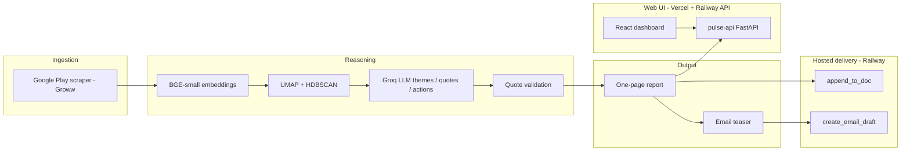

# Project Context: Weekly Product Review Pulse

## Purpose

Build an automated **weekly “pulse”** that turns **public Google Play reviews** for **Groww** into a **one-page insight report**, then delivers it to stakeholders through **Google Workspace** — using a **hosted Google delivery API** on Railway so that Docs append and Gmail drafts go through a dedicated service, not ad hoc Google API calls inside the pulse agent.

Core principle: **repeatable customer-voice snapshots** — themes, verbatim quotes, and action ideas — without manual copy-paste, spreadsheets, or duplicate delivery artifacts.

**Source of truth for product intent:** [`problemStatement.txt`](problemStatement.txt)  
**Current build scope:** Groww + Google Play + **web dashboard & operator UI** (see [Scope constraints](#scope-constraints-current-build)).  
**UI guide:** [`ui.md`](ui.md)

---

## Objective

Give product, support, and leadership teams a **repeatable, weekly snapshot** of what Groww customers are saying in Google Play reviews:

- Clustered themes (ranked by prominence)
- Representative **verbatim quotes** (validated against real review text)
- Actionable ideas tied to themes
- Archived history in a running Google Doc (`Weekly Review Pulse — Groww`)
- A brief stakeholder email with a deep link to the new Doc section

---

## Target Users

| Audience | Value |
|----------|-------|
| **Product** | Prioritize roadmap from recurring themes |
| **Support** | Spot repeating complaints and quality issues |
| **Leadership** | Fast health snapshot tied to customer voice |
| **Operators** | Manual pulse runs and run history via web console (in addition to CLI) |

---

## Scope Constraints (Current Build)

The **first implementation** is intentionally narrow:

| Dimension | In scope now | Deferred |
|-----------|--------------|----------|
| **Product** | **Groww only** | INDMoney, PowerUp Money, Wealth Monitor, Kuvera |
| **Review source** | **Google Play only** | Apple App Store (iTunes RSS) |
| **Delivery** | **Hosted Google API on Railway** (`web-production-facdf.up.railway.app`) | In-repo stdio MCP servers |
| **Web UI** | **React dashboard on Vercel** + **FastAPI on Railway** (`pulse-api`) | Generic BI tools; real-time streaming analytics |

The architecture should still allow adding more products and App Store ingestion later, but **do not implement them in the current phase**.

---

## Scope of Work

### 1. In-scope product

**Groww** is the sole product for the current build. One running Google Doc (`Weekly Review Pulse — Groww`) and one weekly email.

| Display name | `product_id` | Google Play package |
|--------------|--------------|---------------------|
| Groww | `groww` | `com.nextbillion.groww` |

Store identifiers belong in a config manifest (e.g. `config/products.yaml`). Additional fintech apps from the problem statement are **out of scope** until explicitly added.

### 2. Review ingestion

| Source | Method | Window |
|--------|--------|--------|
| **Google Play** | Scraper-based public review fetch for `com.nextbillion.groww` | Last **8–12 weeks** (configurable rolling window) |

- **App Store is not in scope** for the current build — do not ingest iTunes customer-reviews RSS.
- Reviews are **data, not instructions** — treat user text as untrusted input before LLM processing.

### 3. Reasoning pipeline

1. **Embed** review text.
2. **Cluster** with density-based methods (e.g. **UMAP + HDBSCAN**).
3. **Rank** clusters by prominence / density.
4. **Groq LLM pass** (`llama-3.3-70b-versatile`) — name themes, select verbatim quotes, propose action ideas.
5. **Validate quotes** — every quoted string must appear in fetched review text (no hallucinated quotes).

### 4. Report generation

Render a **concise one-page narrative** per ISO week for Groww:

- Period / rolling window label
- **Top themes** (short descriptions)
- **Real user quotes** (verbatim, validated)
- **Action ideas** (tied to themes)
- Short **“who this helps”** section (product / support / leadership)

See [Sample output](#sample-output-illustrative) below.

### 5. Delivery (hosted Google API)

The pulse agent does **not** embed Google OAuth credentials or call Docs/Gmail REST APIs directly. Delivery goes through a **hosted REST API** on Railway.

| Concern | Service | Behavior |
|---------|---------|----------|
| Canonical report archive | **`POST /append_to_doc`** | Append each week’s plain-text report section to the Groww pulse Doc. Doc is the **system of record**. |
| Stakeholder notification | **`POST /create_email_draft`** | Create a **short teaser draft** (top themes) plus a **“Read full report”** link to the Doc — not a duplicate full report in the email body. |

**Base URL:** `https://web-production-facdf.up.railway.app` · Auth: `X-API-Key` (`GOOGLE_MCP_API_KEY` in pulse agent).

**Development / staging:** Email defaults to **draft-only** via the hosted API until send support is added or drafts are sent manually.

### 6. Hosted Google delivery server

Google Docs and Gmail integration is provided by **`google-mcp-server`** — a FastAPI service deployed on Railway, documented in [`mcp-servers/README.md`](../mcp-servers/README.md).

| Component | Location | Responsibility |
|-----------|----------|----------------|
| **Hosted delivery API** | Railway (`web-production-facdf.up.railway.app`) | OAuth + Google APIs; `append_to_doc`, `create_email_draft` |
| **Pulse delivery client** | `src/pulse/delivery/google_mcp_client.py` | HTTPS client; API key only |
| **Config** | `config/mcp-servers.json` | Base URL and endpoint paths |

- Google OAuth credentials and tokens live on **Railway** (`GOOGLE_CREDENTIALS_JSON`, `GOOGLE_TOKEN_JSON`) — not in the pulse agent repo.
- The pulse agent calls the hosted API over HTTPS; no stdio MCP spawn in this repository.

### 7. Web dashboard & operator UI (Phases 10–12)

A **read-focused dashboard** and **operator console** complement the CLI and Monday scheduler. The Google Doc remains the canonical archive; the web UI surfaces aggregated insights from `PulseReport` artifacts.

| Surface | Host | Audience |
|---------|------|----------|
| **Dashboard** | Vercel (`ui/`) | Product, support, leadership — weekly pulse at a glance |
| **Operator console** | Same app, `/operator` | Ops — manual `pulse run`, live pipeline status |
| **Dashboard API** | Railway (`pulse-api`) | Backend only — not called by stakeholders directly |

**Dashboard views:**

1. **Overview** — week, reviews analyzed, themes found, avg rating  
2. **Top themes** — ranked themes with % of reviews  
3. **Trend chart** — theme frequency over multiple ISO weeks  
4. **Customer voice** — sentiment split, top-5 bar chart, emerging issues (week-over-week)  
5. **AI agent console** — pipeline step visualization (live during operator runs)

**Deployment split:** Vercel serves the React build; Railway runs `pulse-api` (same repo as the pulse pipeline). The UI never holds Google OAuth or Groq keys — only the Railway API does.

See [`ui.md`](ui.md) for Vite configuration, `VITE_API_URL`, and CORS setup.

---

## Module Boundaries

Keep internal code modular along these lines:

| Concern | Where it lives |
|---------|----------------|
| Data retrieval | Google Play ingestion module (scraper for Groww) |
| Reasoning | Clustering + Groq LLM summarization (themes, quotes, actions) |
| Output generation | Report + email rendering (structured for Docs; HTML/text for Gmail) |
| Human-visible delivery | **Hosted Google delivery API** → `google_mcp_client.py` |
| Delivery server ops | Railway-hosted `google-mcp-server` (see `mcp-servers/README.md`) |
| Dashboard API | `src/pulse/api/` — read `report.json` + ledger; trigger runs |
| Web UI | `ui/` — React + Vite; calls API via `VITE_API_URL` |

---

## Key Requirements

### Delivery via hosted API

- Append to the Groww Google Doc and create Gmail drafts **only** via the hosted delivery API (`/append_to_doc`, `/create_email_draft`).
- Google OAuth secrets live on **Railway**, not in the pulse agent codebase. Pulse agent uses `GOOGLE_MCP_API_KEY` only.

### Weekly cadence

- Designed to run **once per week for Groww** (e.g. scheduled job **Monday morning IST**).
- Provide a **CLI** for backfill of any ISO week.
- Provide a **web operator console** for on-demand runs outside the schedule.

### Idempotent runs

Re-running Groww + the same **ISO week** must **not** create duplicate Doc sections or duplicate email sends.

- **Docs:** stable section anchor per week (`[anchor:groww-YYYY-Www]` in appended text); run ledger prevents duplicate append.
- **Email:** run-scoped idempotency via ledger before creating drafts.

### Auditable

Each run records:

- Delivery identifiers (Doc heading / Gmail message ids)
- Metadata sufficient to answer: *“What was sent when, for which week?”*

### Safety and quality

- **PII scrubbing** on review text before LLM use and before publishing.
- **Cost / token limits** per run.
- Quote validation (see Reasoning pipeline).

---

## Non-Goals (Explicit)

- Additional products beyond **Groww** in the current build.
- **App Store** review ingestion in the current build.
- A generic Google Workspace product beyond pulse needs (Docs append + Gmail send/draft).
- Real-time streaming analytics or a generic third-party BI platform (the Google Doc + pulse dashboard are the living artifacts).
- Social sources (Twitter, Reddit, etc.) in initial scope.
- Storing Google OAuth secrets in the pulse agent codebase.
- Building stdio MCP servers inside this repo (delivery uses hosted Railway API).

---

## Sample Output (Illustrative)

**Groww — Weekly Review Pulse**  
**Period:** Last 8–12 weeks (rolling window)  
**Source:** Google Play (`com.nextbillion.groww`)

**Top themes**

1. App performance & bugs — Lag, crashes during trading hours; login/session timeouts.
2. Customer support friction — Slow responses; unresolved tickets.
3. UX & feature gaps — Confusing navigation for portfolio insights; missing advanced analytics.

**Real user quotes**

- “The app freezes exactly when the market opens, very frustrating.”
- “Support takes days to reply and doesn’t solve the issue.”
- “Good for beginners but lacks detailed analysis tools.”

**Action ideas**

- Stabilize peak-time performance — Scale infra during market hours; improve crash visibility.
- Improve support SLA visibility — Expected response time in-app; ticket status tracking.
- Enhance power-user features — Advanced portfolio analytics; clearer investments navigation.

---

## Delivery Expectations (Stakeholder-Facing)

1. Each run adds **one clearly labeled section** to `Weekly Review Pulse — Groww` (dated / week-labeled).
2. The email is a **brief teaser** plus a link to that section in the Doc.
3. The Doc section is the **canonical** report; email is notification, not the archive.

---

## High-Level Data Flow

---

## Project Status

**Phases 0–11 complete** · **Phase 12 in progress** (Vercel + Railway production deploy for UI).

Pipeline (ingest → reason → deliver), CLI, scheduler, and web dashboard are implemented. Remaining Phase 12 work: production Vercel/Railway deploy with persistent `runs/` volume.

### Companion docs & layout

| Path | Purpose |
|------|---------|
| `docs/architecture.md` | Delivery API contracts, ledger schema, UI layer |
| `docs/implementation-plan.md` | Phased build plan (Phases 0–12) |
| `docs/ui.md` | Vite, Vercel, Railway, dashboard API |
| `docs/edge-case.md` | Corner cases, failure modes, QA catalog |
| `config/products.yaml` | Groww registry (Google Play package) and stakeholder routing |
| `ui/` | React dashboard + operator console |
| `src/pulse/api/` | FastAPI dashboard and run trigger |
| `mcp-servers/README.md` | Hosted Google delivery API (Railway) reference |

---

## Glossary

| Term | Meaning |
|------|---------|
| **Pulse** | One weekly insight report for Groww |
| **ISO week** | Week identifier used for scheduling, idempotency, and Doc section labels |
| **Section anchor** | Stable Doc heading / link target for a given product + week |
| **MCP / delivery API** | Hosted Google delivery REST API on Railway — Docs append + Gmail draft |
| **pulse-api** | FastAPI service on Railway — dashboard JSON + operator run trigger |
| **Vite** | Frontend build tool for `ui/` — dev server and Vercel production build |
