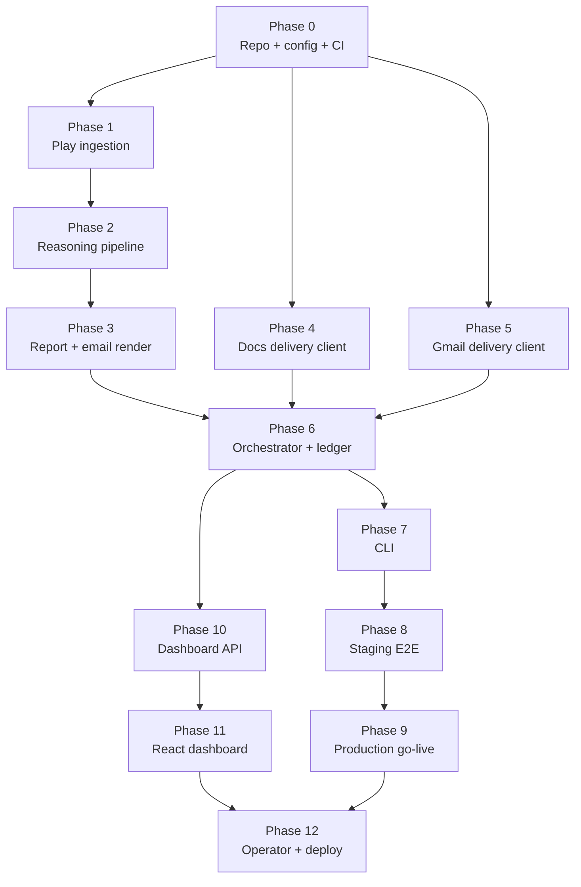

# Implementation Plan: Weekly Product Review Pulse (Groww)

Phase-wise plan to build the automated **weekly review pulse** for **Groww** (Google Play only), with delivery via a **hosted Google delivery API** on Railway (`https://web-production-facdf.up.railway.app`) for Docs append and Gmail drafts.

**Related documents:** [`context.md`](context.md) · [`architecture.md`](architecture.md) · [`edge-case.md`](edge-case.md) · [`problemStatement.txt`](problemStatement.txt)

**Current build scope:** Groww · `com.nextbillion.groww` · Google Play · Docs append + Gmail teaser · **Web dashboard + operator UI** (Phases 10–12).

**UI operations guide:** [`ui.md`](ui.md)

---

## 1. Plan overview

### 1.1 Goal

Deliver an end-to-end weekly pipeline that:

- Ingests public Google Play reviews for Groww over a configurable 8–12 week window
- Clusters feedback, summarizes themes with validated verbatim quotes and action ideas
- Appends a one-page report section to `Weekly Review Pulse — Groww` via **hosted `/append_to_doc` API**
- Notifies stakeholders via **hosted `/create_email_draft` API** (draft in staging; send requires server extension or manual send)
- Records every run in an auditable ledger with idempotent re-runs per ISO week

### 1.2 Phase map

Thirteen phases (0–12). **Phases 4 and 5** (delivery HTTP client) can start **in parallel after Phase 0**. **Phases 10–11** (dashboard API + React UI) can start **after Phase 6** once `PulseReport` artifacts and the ledger exist.



| Phase | Focus | Primary outcome | Status |
|-------|-------|-----------------|--------|
| **0** | Repo skeleton, config, tooling, CI smoke | Installable project; config loads; CI green | Done |
| **1** | Groww Play Store ingestion + `Review` model | Raw JSON + normalized reviews | Done |
| **2** | PII scrub → embed → UMAP/HDBSCAN → Groq LLM → quote validation | `PulseReport` JSON | Done |
| **3** | Doc plain-text section + email teaser rendering | `doc_section.json` + email payload from report | Done |
| **4** | Docs delivery HTTP client | `append_to_doc` via Railway API | Done |
| **5** | Gmail delivery HTTP client | `create_email_draft` via Railway API | Done |
| **6** | Orchestrator + SQLite run ledger | Wired pipeline + idempotent run state | Done |
| **7** | CLI: `run`, `dry-run`, `backfill`, `status` | Operator-facing commands | Done |
| **8** | Staging E2E, safety audit, runbook | Signed-off staging run | Done |
| **9** | Production Doc, scheduler, draft-mode go-live | Monday IST automated pulse | Done |
| **10** | Dashboard API + `PulseReport` analytics | FastAPI read endpoints; sentiment / theme % | **Done** |
| **11** | React dashboard (Vercel) | Overview, themes, trends, customer voice, agent console | **Done** |
| **12** | Operator console + Railway API deploy | Manual run UI; Vercel + Railway; backfill for trends | In progress |

*Phases 0–9 ~22–32 days. Phases 10–12 ~5–8 days additional.*

### 1.3 Why this phasing works

| Design choice | Rationale |
|---------------|-----------|
| **MCP early (P4/P5)** | Delivery client depends only on Railway API + fixture `doc_section.json` / `email.json` — not on live ingestion or LLM. Can be built while P1–P3 proceed. |
| **Render separate from reasoning (P3)** | `PulseReport` JSON is a stable contract; render and MCP can be tested with checked-in fixtures. |
| **Orchestrator late (P6)** | All stage implementations exist before wiring; avoids rewriting the orchestrator each phase. |
| **CLI late (P7)** | Phases 1–6 use `pytest` and `scripts/` helpers; CLI wraps the finished orchestrator once. |
| **Staging vs prod split (P8/P9)** | Clear sign-off gate before `email_mode: send` and production Doc id. |

**Caveat:** Run-level idempotency (ledger) is not enforced until **Phase 6**. During P1–P5 development, avoid repeated live append/draft calls for the same ISO week, or rely on manual checks — the hosted API does not dedupe by anchor.

### 1.4 End-state repository layout

```
Product_Review_Pulse/
├── config/
│   ├── products.yaml
│   ├── products.example.yaml
│   ├── pulse.yaml
│   └── mcp-servers.json
├── src/pulse/
│   ├── api/                    # Phase 10–12 — FastAPI dashboard + operator
│   │   ├── main.py
│   │   ├── routes/
│   │   └── services/
│   └── delivery/
│       └── google_mcp_client.py  # Phase 4/5 HTTP client
├── ui/                         # Phase 11 — React + Vite (Vercel)
│   ├── vite.config.ts
│   ├── vercel.json
│   └── src/
├── mcp-servers/
│   └── README.md               # Hosted API reference (Railway)
├── data/                       # gitignored
├── runs/                       # gitignored (ledger.db, report.json per week)
├── tests/
├── scripts/                    # dev helpers; seed_dashboard.py
├── railway.toml                # Phase 12 — pulse-api on Railway
├── .github/workflows/          # CI smoke (Phase 0)
├── docs/
│   └── ui.md                   # Phase 11–12 — Vite/Vercel/Railway guide
├── .env.example
├── pyproject.toml
└── README.md
```

---

## 2. Cross-cutting requirements (all phases)

| Requirement | Implementation checkpoint |
|-------------|---------------------------|
| **Groww only** | Single `groww` entry in `products.yaml` |
| **Google Play only** | `Review.source` always `google_play` |
| **MCP delivery boundary** | Pulse agent has no Google OAuth; only `GOOGLE_MCP_API_KEY` |
| **Doc is canonical** | Full report in Docs; email is teaser + link |
| **Idempotent weekly runs** | `(groww, iso_week)` → one section, one draft/send — enforced from **P6** |
| **Quote validation** | No quote published without corpus substring match — **P2** |
| **PII scrub** | Before embed and publish — **P2** |
| **Reviews as data** | Prompt-injection-safe summarizer — **P2** |
| **Auditable runs** | Ledger with delivery ids — **P6** |
| **Staging email = draft** | Until **P9** go-live |

---

## 3. Prerequisites (before Phase 0)

| Item | Owner | Notes |
|------|-------|-------|
| Python 3.11+ | Dev | Shared runtime for pulse agent + MCP servers |
| Groq API key (`GROQ_API_KEY`) | Dev / ops | Needed from Phase 2 (summarization); embeddings are local BGE-small (no API key) |
| Google Cloud project + Railway deploy | Ops | OAuth on hosted `google-mcp-server`; pulse agent needs API key only |
| GitHub / CI | Dev | Phase 0 smoke workflow |

---

## 4. Phase 0 — Repo skeleton, config, tooling, CI smoke

### 4.1 Objectives

Bootstrap the repository without business logic or external API calls.

### 4.2 Tasks

| # | Task | Details |
|---|------|---------|
| 0.1 | `pyproject.toml` | Package layout, dev deps, ruff/black/pytest |
| 0.2 | Directory scaffold | `src/pulse/`, `mcp-servers/`, `config/`, `tests/`, `scripts/` |
| 0.3 | Config templates | `products.example.yaml`, `pulse.yaml`, `mcp-servers.json` |
| 0.4 | Config loader | `config.py` — load YAML, validate Groww package id, IST timezone helper |
| 0.5 | `.env.example` / `.gitignore` | No secrets; ignore `data/`, `runs/`, credentials |
| 0.6 | CI smoke | GitHub Actions: install, lint, `pytest tests/unit/test_config.py` |
| 0.7 | Dev scripts stub | `scripts/README.md` — how to run module tests per phase |

### 4.3 Deliverables

- `pip install -e ".[dev]"` succeeds
- CI passes on empty/scaffold tests
- Config loads Groww entry from example file

### 4.4 Acceptance criteria

- [ ] CI green on push
- [ ] ISO week helper unit test passes (`Asia/Kolkata`)
- [ ] No secrets in repo

---

## 5. Phase 1 — Groww Play Store ingestion + Review model

### 5.1 Objectives

Fetch public reviews for `com.nextbillion.groww`, normalize to the `Review` model, and filter to English reviews with at least 8 words and no emojis. No PII scrub or LLM yet.

### 5.2 Tasks

| # | Task | Details |
|---|------|---------|
| 1.1 | `Review` model | `ingest/models.py` per architecture §6.1 |
| 1.2 | Play scraper | `ingest/play_store.py` — paginate, backoff, date window from config |
| 1.3 | Review ID stability | Play id or hash fallback |
| 1.4 | Raw audit JSON | `data/raw/{iso_week}/groww.json` |
| 1.5 | Normalization filters | Drop reviews with &lt;8 words, emojis, or non-English text |
| 1.6 | Min reviews guard | Raise if below threshold after normalization (callable from tests) |
| 1.7 | Dev script | `scripts/fetch_reviews.py --week 2026-W23` |

### 5.3 Deliverables

- `scripts/fetch_reviews.py` writes raw + prints `review_count`
- Fixture: `tests/fixtures/groww_reviews_sample.json`

### 5.4 Acceptance criteria

- [ ] Live fetch returns ≥ `min_reviews_required` for Groww (or documented test override)
- [ ] `Review` model serializes/deserializes cleanly
- [ ] Raw JSON auditable per ISO week

### 5.5 Tests

- `tests/unit/test_play_store.py` (mocked scraper)
- Optional: `tests/integration/test_ingest_live.py` (network, marked)

---

## 6. Phase 2 — Reasoning pipeline

### 6.1 Objectives

**PII scrubber → embeddings → UMAP/HDBSCAN → Groq LLM → quote validation** → `PulseReport` JSON.

Input is **`IngestResult.reviews`** (full `Review` objects with `review_id`) — not `groww_normalized.json` alone (that export omits ids needed for quote validation and embed cache).

### 6.2 Groq LLM quotas & pacing

**Provider:** Groq · **Model:** `llama-3.3-70b-versatile`

| Limit | Quota | Pipeline implication |
|-------|-------|---------------------|
| Requests / minute | 30 | Summarize **sequentially** (one request per cluster); no parallel LLM burst |
| Requests / day | 1,000 | ~6–12 requests per weekly run (5 themes + audience blurb + ≤1 retry/theme); fine for Mon production + limited dev |
| Tokens / minute | 12,000 | **Pacing required** — rolling 60s token meter; sleep/retry when next call would exceed TPM |
| Tokens / day | 100,000 | Hard daily ceiling across all runs; pre-flight check before first LLM call |

**Typical Groww run (~1.3k normalized reviews, `top_k_themes: 5`):** ~2.5–3.5K tokens per cluster request → ~15–20K tokens/run total. Fits in 100K/day but **cannot** be issued in a single minute without throttling (exceeds 12K TPM).

**Design constraints (enforced in 2.4 / 2.6):**

- One Groq request per cluster (not one monolithic multi-theme prompt).
- At most **one** validation re-prompt per theme (caps worst-case requests at ~12/run).
- Truncate cluster snippets so each request stays ≲4K tokens (input + output).
- CI and unit tests **mock** Groq; optional marked integration test for live quota smoke.

**`config/pulse.yaml` (LLM section):**

```yaml
llm:
  provider: groq
  model: llama-3.3-70b-versatile
  temperature: 0.2
  max_tokens_per_request: 4096    # per API call completion cap
  max_tokens_per_run: 20000       # soft cap per pipeline run; abort if projected total exceeds
  rate_limits:
    requests_per_minute: 30
    requests_per_day: 1000
    tokens_per_minute: 12000
    tokens_per_day: 100000
```

### 6.3 Tasks

| # | Task | Details |
|---|------|---------|
| 2.1 | PII scrubber | `pipeline/scrub.py` — PII patterns, whitespace; input = `Review` list with `review_id` |
| 2.2 | Embedder | `pipeline/embed.py` — local **BGE-small** (`BAAI/bge-small-en-v1.5`) + optional cache keyed by `review_id`; TF-IDF for fast tests |
| 2.3 | Clusterer | `pipeline/cluster.py` — UMAP, HDBSCAN, rank (size + optional rating extremity), top-k |
| 2.4 | Summarizer | `pipeline/summarize.py` — Groq client, `llama-3.3-70b-versatile`, structured JSON, injection-safe prompts; **one sequential request per cluster** |
| 2.5 | Quote validator | `pipeline/validate.py` — substring match against scrubbed corpus by `review_id` |
| 2.6 | Token budget & rate pacing | `pipeline/llm_budget.py` (or equivalent) — track tokens and requests per run, rolling 60s TPM, and daily TPD; sleep/retry on 429; abort if over `max_tokens_per_run` or projected daily remainder |
| 2.7 | Report builder | `PulseReport` with themes, audience blurb (audience blurb = +1 Groq call, counted in budget) |
| 2.8 | Dev script | `scripts/run_reasoning.py` — input from ingest `Review` list or re-ingest; output `report.json`; `--mock-llm` for quota-free dev |

### 6.4 Deliverables

- `PulseReport` JSON from sample or live reviews
- Tuned `pulse.yaml` clustering params after first live run
- `pulse.yaml` Groq `llm` block per §6.2

### 6.5 Acceptance criteria

- [ ] 3–5 themes for typical Groww volume
- [ ] All published quotes pass validation
- [ ] PII scrubbed before embed
- [ ] Single live run stays within Groq TPM (paced) and TPD
- [ ] `max_tokens_per_run` and per-request cap enforced in tests (mocked Groq)

### 6.6 Tests

- `tests/unit/test_scrub.py`, `test_validate.py`, `test_cluster.py`, `test_llm_budget.py`
- Golden path: fixture reviews → `PulseReport` snapshot (mocked Groq)
- Optional: `tests/integration/test_groq_summarize.py` (network, marked; manual quota smoke)

---

## 7. Phase 3 — Doc plain-text section + email teaser rendering

### 7.1 Objectives

Convert `PulseReport` → `DocStructuredReport` (plain `content`) and Gmail teaser payload. **No delivery HTTP calls** — pure functions.

### 7.2 Tasks

| # | Task | Details |
|---|------|---------|
| 3.1 | Doc renderer | `render/report.py` — plain-text section per architecture §9.1 |
| 3.2 | Section anchor | Embed `groww-{iso_week}` as `[anchor:…]` in `content` |
| 3.3 | Email renderer | `render/email.py` — subject, HTML, plain text; ≤3 theme bullets |
| 3.4 | Fixture I/O | `tests/fixtures/report_groww_sample.json` → `doc_section.json`, `email.json` |
| 3.5 | Dev script | `scripts/render_report.py --report report.json` |

### 7.3 Deliverables

- `doc_section.json` and email payload JSON from fixture `PulseReport`
- Stakeholder review of rendered plain-text preview (optional script)

### 7.4 Acceptance criteria

- [ ] Doc structure matches sample output in `context.md` (plain text, not formatted blocks)
- [ ] Email has no full quotes or full action list
- [ ] `section_anchor` derived correctly from `product_id` + `iso_week`

### 7.5 Tests

- `tests/unit/test_report_render.py`, `test_email_render.py`

---

## 8. Phase 4 — Docs delivery HTTP client (hosted API)

### 8.1 Objectives

Integrate pulse agent with the **hosted Google delivery API** on Railway for plain-text Doc append. OAuth and Google Docs API calls stay on the server — pulse agent uses HTTPS only.

**Base URL:** `https://web-production-facdf.up.railway.app`

### 8.2 Tasks

| # | Task | Details |
|---|------|---------|
| 4.1 | Delivery client | `delivery/google_mcp_client.py` — `append_to_doc(doc_id, content)` |
| 4.2 | Config | `config/mcp-servers.json` — `baseUrl`, endpoints; `.env` — `GOOGLE_MCP_API_KEY` |
| 4.3 | Auth header | Send `X-API-Key` on every POST; map 401/403 to clear errors |
| 4.4 | Idempotency guard | Document ledger responsibility (Phase 6); optional pre-append ledger check in client tests |
| 4.5 | Fixture smoke | Append `tests/fixtures/doc_section_groww_sample.json` `content` to test Doc |
| 4.6 | Dev script | `scripts/test_doc_append.py` — curl-equivalent smoke from fixture |
| 4.7 | README | `mcp-servers/README.md` — endpoints, env vars, troubleshooting |

### 8.3 Deliverables

- `google_mcp_client.append_to_doc()` callable with config + API key
- Test Doc section appended from fixture `content` via Railway

### 8.4 Acceptance criteria

- [ ] Pulse agent has no Google OAuth files
- [ ] Successful append returns `document_id` + `appended_chars`
- [ ] Double append same week prevented by ledger (Phase 6) — not by hosted API
- [ ] `GOOGLE_MCP_API_KEY` never committed

### 8.5 Tests

- `tests/unit/test_google_mcp_client.py` (mocked HTTP)
- Manual: verify section text in browser; `GET /health` returns `ok`

---

## 9. Phase 5 — Gmail delivery HTTP client (hosted API)

### 9.1 Objectives

Integrate pulse agent with **`POST /create_email_draft`** on the same Railway host. Use plain-text `body_text` from Phase 3 email renderer.

### 9.2 Tasks

| # | Task | Details |
|---|------|---------|
| 5.1 | Draft client method | `google_mcp_client.create_email_draft(to, subject, body)` |
| 5.2 | Multi-recipient | Loop `stakeholders.to[]` — API accepts one `to` per request |
| 5.3 | Idempotency | Track `draft_id` / `message_id` in run ledger (Phase 6); key `pulse/{product_id}/{iso_week}` |
| 5.4 | Email mode | `delivery.email_mode: draft` → call draft endpoint; **send** not available on hosted API until extended |
| 5.5 | Fixture smoke | Draft from `tests/fixtures/email_groww_sample.json` (`body_text` field) |
| 5.6 | Dev script | `scripts/test_email_draft.py` — smoke draft to test inbox |

### 9.3 Deliverables

- Draft visible in connected Gmail account
- “Read full report” link uses Doc base URL from `EmailPayload.doc_url`

### 9.4 Acceptance criteria

- [ ] Duplicate run (same ISO week) does not create duplicate drafts once ledger wired (Phase 6)
- [ ] Teaser-only body (no full report)
- [ ] Recipients from `products.yaml`

### 9.5 Tests

- `tests/unit/test_google_mcp_client.py` (mocked HTTP for draft)
- Manual: open draft in Gmail UI

---

## 10. Phase 6 — Orchestrator + SQLite run ledger

### 10.1 Objectives

Wire **ingest → reason → render → hosted Docs API → hosted Gmail API** with persistent run state and failure recovery.

### 10.2 Tasks

| # | Task | Details |
|---|------|---------|
| 6.1 | Ledger models + store | `ledger/models.py`, `ledger/store.py` — SQLite `runs/ledger.db` |
| 6.2 | Delivery client | `delivery/google_mcp_client.py` — HTTP to Railway; health check before delivery |
| 6.3 | Orchestrator | `orchestrator.py` — stage machine per architecture §4 |
| 6.4 | Idempotency guards | Skip completed runs; ledger prevents duplicate append/draft per ISO week |
| 6.5 | `--from-stage delivery` | Retry after partial failure |
| 6.6 | `--force` | Recompute insights; delivery still idempotent |
| 6.7 | Structured logging | Per-stage JSON events |

### 10.3 Deliverables

- Programmatic full run: `python -m pulse.orchestrator --product groww --week …`
- Ledger records `completed` with Doc + Gmail ids

### 10.4 Acceptance criteria

- [ ] End-to-end run via orchestrator module (pre-CLI)
- [ ] Re-run same week → ledger short-circuit or MCP no-op
- [ ] Failed email → rerun `--from-stage delivery` succeeds
- [ ] Audit fields populated on `RunRecord`

### 10.5 Tests

- `tests/unit/test_ledger.py`
- `tests/unit/test_orchestrator.py` (mocked ingest, LLM, HTTP delivery)

---

## 11. Phase 7 — CLI

### 11.1 Objectives

Operator-facing CLI wrapping the orchestrator.

### 11.2 Tasks

| # | Task | Details |
|---|------|---------|
| 7.1 | `pulse run` | `--product groww [--week YYYY-Www] [--force] [--from-stage]` |
| 7.2 | `pulse dry-run` | Ingest + reason + render; no delivery HTTP; write `report.json` |
| 7.3 | `pulse backfill` | Alias / wrapper for `run --week` over a range |
| 7.4 | `pulse status` | Show ledger row for product + week |
| 7.5 | Entry point | `pyproject.toml` → `pulse = pulse.cli:main` |

### 11.3 Deliverables

- `pulse run --product groww` equals orchestrator full run
- `pulse status --product groww --week 2026-W23` prints ledger summary

### 11.4 Acceptance criteria

- [ ] All four commands documented in README
- [ ] Invalid `product_id` rejected
- [ ] `--dry-run` never calls Railway delivery API

---

## 12. Phase 8 — Staging E2E, safety audit, runbook

### 12.1 Objectives

Validate full system in staging before production credentials and send mode.

### 12.2 Tasks

| # | Task | Details |
|---|------|---------|
| 8.1 | Staging config | Test Doc id, dev recipient emails, `email_mode: draft` |
| 8.2 | E2E test run | `pulse run --product groww` against staging |
| 8.3 | Idempotency test | Double-run same ISO week |
| 8.4 | Safety audit | PII spot-check on quotes; prompt-injection sample reviews; token cap; walk P0 items in [`edge-case.md`](edge-case.md) |
| 8.5 | Runbook | `docs/runbook.md` — failures, rerun, Railway token refresh, audit SQL |
| 8.6 | Stakeholder review | Sign-off on one staging Doc section + draft email |

### 12.3 Deliverables

- Completed staging run in ledger
- Signed runbook + audit checklist

### 12.4 Acceptance criteria

- [ ] Draft email link opens correct Doc (base URL)
- [ ] No duplicate Doc section on rerun
- [ ] Safety checklist passed (documented in runbook)
- [ ] Product/support stakeholder approves sample pulse quality

---

## 13. Phase 9 — Production Doc, scheduler, send-mode go-live

### 13.1 Objectives

Point at production Doc, enable `email_mode: send`, schedule weekly Monday IST run.

### 13.2 Tasks

| # | Task | Details |
|---|------|---------|
| 9.1 | Production config | Real `document_id`, stakeholder `to`/`cc`, `email_mode: send` |
| 9.2 | Scheduler | Cron `0 8 * * 1` TZ=`Asia/Kolkata` or Windows Task Scheduler doc |
| 9.3 | First live send | Monitor run; verify ledger + Doc + Gmail message id |
| 9.4 | README final | Setup, env, CLI, links to all docs |
| 9.5 | Backfill (optional) | Run prior ISO weeks if needed |

### 13.3 Deliverables

- Production weekly pulse live
- First Monday scheduled run successful

### 13.4 Acceptance criteria

- [ ] `pulse run --product groww` sends to real stakeholders
- [ ] Scheduler documented and active
- [ ] Definition of done (§18) satisfied

---

## 14. Phase 10 — Dashboard API + report analytics

**Status: complete**

### 14.1 Objectives

Expose read-only dashboard data from `runs/{product}/{iso_week}/report.json` and the run ledger via **FastAPI**, with analytics fields on `PulseReport` for the web UI.

### 14.2 Tasks

| # | Task | Details |
|---|------|---------|
| 10.1 | Analytics on `PulseReport` | `avg_rating`, `sentiment`, `ThemeInsight.review_count` / `review_share_pct` |
| 10.2 | `pipeline/analytics.py` | Sentiment from star ratings; theme share %; week-over-week deltas |
| 10.3 | FastAPI app | `src/pulse/api/main.py` — CORS, `/health` |
| 10.4 | Dashboard routes | `/api/dashboard/overview`, `/themes`, `/trends`, `/customer-voice`, `/weeks` |
| 10.5 | Run routes | `POST /api/runs`, `GET /api/runs/jobs/{id}`, `GET /api/runs` |
| 10.6 | `pulse-api` entry point | `pyproject.toml` → `pulse-api = pulse.api.main:main` |
| 10.7 | Tests | `tests/unit/test_analytics.py` |

### 14.3 Deliverables

- `pip install -e ".[ui]"` and `pulse-api` serves dashboard JSON
- Multi-week trend data from `runs/groww/*/report.json`

### 14.4 Acceptance criteria

- [x] Overview returns review count, theme count, avg rating
- [x] Top themes include `review_share_pct`
- [x] Trends aggregate ≥2 ISO weeks when reports exist
- [x] Customer voice includes sentiment % and emerging issues (week-over-week)

---

## 15. Phase 11 — React dashboard (Vercel)

**Status: complete**

### 15.1 Objectives

Stakeholder-facing **web dashboard** (React + Vite + Recharts) deployed on **Vercel**, calling the FastAPI backend on Railway via `VITE_API_URL`.

### 15.2 Dashboard views (product asks)

| Ask | UI component | API |
|-----|--------------|-----|
| 1 — Overview card | `OverviewCard` | `GET /api/dashboard/overview` |
| 2 — Top themes | `TopThemes` | `GET /api/dashboard/themes` |
| 3 — Trend chart | `TrendChart` | `GET /api/dashboard/trends` |
| 4 — Customer voice | `CustomerVoice` | `GET /api/dashboard/customer-voice` |
| 5 — AI agent console | `AgentConsole` | Static on dashboard; live on Operator page |

### 15.3 Tasks

| # | Task | Details |
|---|------|---------|
| 11.1 | Vite scaffold | `ui/` — `vite.config.ts`, proxy `/api` in dev |
| 11.2 | API client | `ui/src/lib/api.ts` — `VITE_API_URL` for Vercel |
| 11.3 | Dashboard page | Week selector; all five views |
| 11.4 | Vercel config | `ui/vercel.json`, `ui/.env.example` |
| 11.5 | Docs | `docs/ui.md` — local dev + Vercel env setup |

### 15.4 Acceptance criteria

- [x] `npm run build` succeeds
- [x] Local dev: `npm run dev` + `pulse-api` (Vite proxies `/api`)
- [x] Week selector loads available ISO weeks from API
- [x] Trend chart renders multi-week series after backfill

---

## 16. Phase 12 — Operator console + production deploy

**Status: in progress**

### 16.1 Objectives

Browser-based **manual pulse trigger** (complementing CLI and Monday scheduler), with **Railway** hosting `pulse-api` and **Vercel** hosting the React UI.

### 16.2 Tasks

| # | Task | Details |
|---|------|---------|
| 12.1 | Operator page | `ui/src/pages/OperatorPage.tsx` — Run Pulse, dry-run, mock LLM, force |
| 12.2 | Background run executor | `api/services/run_executor.py` — thread + ledger sync |
| 12.3 | Live agent console | Poll `GET /api/runs/jobs/{job_id}` for pipeline steps |
| 12.4 | Railway deploy | `railway.toml` — `pulse-api`; volume on `runs/` |
| 12.5 | Vercel deploy | Root `ui/`; set `VITE_API_URL` |
| 12.6 | CORS | `CORS_ORIGINS` on Railway includes Vercel URL |
| 12.7 | Historical backfill | `pulse backfill --from-week … --to-week …` for trend charts |
| 12.8 | Demo seed (dev) | `POST /api/dashboard/seed-demo` or `scripts/seed_dashboard.py` |

### 16.3 Deliverables

- Operator can trigger `pulse run` from browser
- Vercel UI → Railway API → existing orchestrator → MCP delivery
- Persistent `runs/` on Railway volume

### 16.4 Acceptance criteria

- [x] Operator page triggers run and shows live pipeline steps
- [ ] Vercel production URL loads dashboard with Railway API
- [ ] Railway volume persists ledger + reports across redeploy
- [x] Backfill populates ≥5 ISO weeks for trends (e.g. `2026-W20`–`W24`)

---

## 17. Environment matrix

| Variable / config | First needed | Used by |
|-------------------|--------------|---------|
| `GROQ_API_KEY` | Phase 2 | Pulse agent — Groq summarization (`llama-3.3-70b-versatile`) |
| `GOOGLE_MCP_API_KEY` | Phase 4 | Pulse agent — `X-API-Key` for Railway delivery API |
| `GOOGLE_MCP_BASE_URL` | Phase 4 | Optional override of `config/mcp-servers.json` `baseUrl` |
| `config/mcp-servers.json` | Phase 4 | Delivery API URL + endpoint paths |
| `config/products.yaml` | Phase 0 | All phases |
| `delivery.email_mode` | Phase 8–9 | `draft` → `send` at go-live |
| `CORS_ORIGINS` | Phase 12 | Railway API — allow Vercel + localhost |
| `VITE_API_URL` | Phase 11–12 | Vercel build — Railway API base URL |

---

## 18. Definition of done (project)

1. `pulse run --product groww` — full pipeline with production config
2. Groww / Google Play only
3. Hosted Google delivery API documented and reachable (`web-production-facdf.up.railway.app`)
4. Idempotent reruns per ISO week (ledger — hosted API does not dedupe)
5. Run ledger answers audit questions
6. Monday 08:00 IST scheduler active
7. README links to `context.md`, `architecture.md`, this plan
8. Dashboard on Vercel shows overview, themes, trends, and customer voice from real `report.json` artifacts
9. Operator can trigger a manual run from the web UI (Phase 12)
10. `docs/ui.md` documents Vite, Vercel, and Railway setup

---

## 19. Risk register

| Risk | Mitigation | Phase |
|------|------------|-------|
| Play scraper breakage | Pin version; raw JSON audit | 1 |
| LLM hallucinated quotes | Validator + retry (max 1 re-prompt/theme) | 2 |
| Groq TPM / TPD exceeded | Sequential calls, rolling token meter, `max_tokens_per_run`, `--mock-llm` in dev | 2 |
| MCP contract drift | Pin `baseUrl`; integration smoke against `/health` | 4, 5 |
| No server-side idempotency | Ledger guards before append/draft | 4–6 |
| OAuth expiry on Railway | Update `GOOGLE_TOKEN_JSON` on hosted server | 4, 5, 8 |
| Hosted API has no send | Draft-only until server extended; manual send or Phase 9 follow-up | 8, 9 |
| Premature production send | `draft` until P9 | 8, 9 |
| Railway ephemeral disk | Mount volume on `runs/`; redeploy wipes ledger without it | 12 |
| Vercel API URL misconfigured | `VITE_API_URL` required at build time; document in `ui.md` | 11, 12 |
| Long runs from browser | `pulse-api` on Railway (not Vercel serverless); background thread | 12 |

---

## 20. Quick reference — what to run per phase

| Phase | How to verify |
|-------|----------------|
| 0 | `pytest` + CI green |
| 1 | `scripts/fetch_reviews.py` |
| 2 | `scripts/run_reasoning.py` → `report.json` |
| 3 | `scripts/render_report.py` → `doc_section.json`, `email.json` |
| 4 | `curl /append_to_doc` or `scripts/test_doc_append.py` with fixture |
| 5 | `curl /create_email_draft` or `scripts/test_email_draft.py` with fixture |
| 6 | `python -m pulse.orchestrator --product groww` |
| 7 | `pulse run` / `pulse dry-run` / `pulse status` |
| 8 | Staging E2E + runbook checklist |
| 9 | Scheduled production `pulse run` |
| 10 | `pulse-api` → `GET /api/dashboard/overview?week=2026-W24` |
| 11 | `cd ui && npm run dev` → dashboard at `localhost:5173` |
| 12 | Vercel deploy + Railway `pulse-api`; Operator → Run Pulse |

---

## 21. Deferred backlog (post-v1)

| Item | Notes |
|------|-------|
| Additional products | `products.yaml` only — same pipeline + dashboard |
| App Store RSS | New ingest module |
| Finer pipeline SSE | Sub-step callbacks in orchestrator for agent console |
| Auth on dashboard | API key or SSO for public Vercel URL |

---

## 22. Document index

| Document | Purpose |
|----------|---------|
| [`context.md`](context.md) | Product scope and sample output |
| [`architecture.md`](architecture.md) | Components, MCP contracts, data models, UI layer |
| [`implementation-plan.md`](implementation-plan.md) | This file |
| [`ui.md`](ui.md) | Vite, Vercel, Railway, API endpoints |
| [`problemStatement.txt`](problemStatement.txt) | Original problem framing |
| `docs/runbook.md` | Created in Phase 8 |
